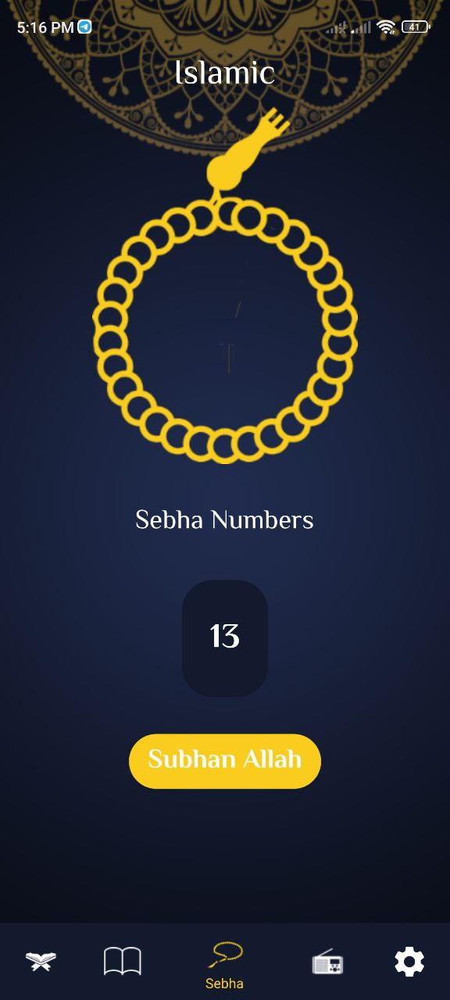
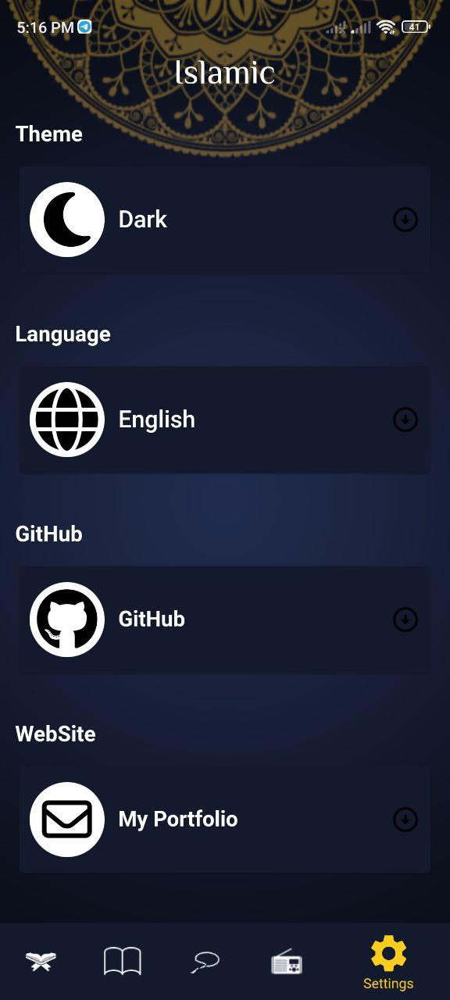
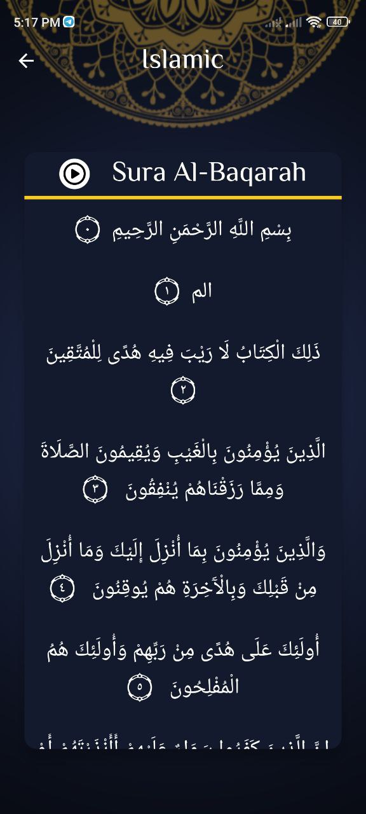
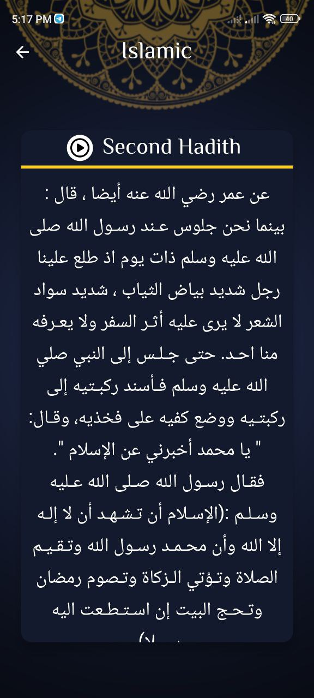

# Muslim

## Download The App
<a href="https://github.com/HusseinMohamed99/Muslim_app/releases/download/v2.0.0/Muslim_App.apk"></img></a>

| Splash Screen | Splash Dark                       |
|------|-------------------------------------------|
||  |
| Quran Screen Light | Quran Screen Dark                       |
|  |  |
| Ahadith Screen Light |  Ahadith Screen Dark                       |
|  |  |
| Sebha Screen Light | sebha Screen Dark                       |
|  |  |
| Settings Screen Light | Settings Screen Dark                       |
|  |  |
| Ayet Screen Light | Ayet Screen Dark                       |
|  |  |
| Hadith Screen Light | Hadith Screen Dark                       |
|  |  |
